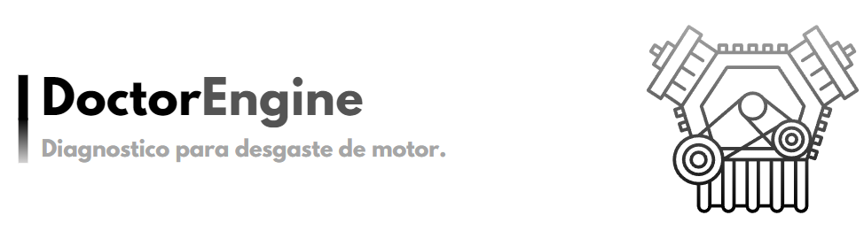

# DoctorEngine I.A

  

<h4>
Projeto da disciplina inteligência artificial, com intuito de gerar um avaliador de desgaste de motor de um veículo de acordo com as condições do óleo presente.
</h4>

## Sumário

- [1. Contexto](#contexto)
- [2. Objetivo](#objetivo)
- [3. Metodologia](#metodologia)
- [4. Tecnologias](#tecnologias)
- [5. Resultados](#resultados)
- [6. Conclusão](#conclusao)
- [7. Time de desenvolvimento](#autores)

<h2 id="contexto">1. Contexto</h2>

 
Este é um projeto para a disciplina de Inteligência Artificial, com o objetivo de desenvolver um avaliador de desgaste de motores de veículos, levando em consideração as condições do óleo utilizado. O projeto visa criar uma ferramenta capaz de fornecer uma avaliação precisa do estado do motor, com base em dados relacionados à quilometragem percorrida e ao tempo de uso do óleo do veículo. O avaliador de desgaste ajudará os usuários a tomar decisões informadas sobre a manutenção preventiva de seus motores, contribuindo assim para a eficiência e longevidade dos veículos.

<h2 id="objetivo">2. Objetivo</h2>

O objetivo deste projeto é desenvolver um avaliador de desgaste de motores de veículos, levando em consideração as condições do óleo utilizado. O avaliador de desgaste ajudará os usuários a tomar decisões informadas sobre a manutenção preventiva de seus motores, contribuindo assim para a eficiência e longevidade dos veículos.

<h2 id="metodologia">3. Metodologia</h2>

Para o desenvolvimento do projeto, foi utilizado o método de desenvolvimento de software em cascata, que é um modelo de processo de software sequencial, no qual o desenvolvimento é visto como um fluxo de atividades de cima para baixo, onde cada fase é concluída antes da próxima fase começar. O modelo em cascata é o modelo mais antigo, mas ainda é usado amplamente em projetos de desenvolvimento de software. Neste modelo, o desenvolvimento de software é dividido em várias fases separadas e distintas, cada uma com seu próprio processo. O modelo em cascata é um modelo de processo de software linear e sequencial, onde cada fase é concluída antes da próxima fase começar. Este modelo é dividido em diferentes fases e a saída de uma fase é a entrada para a próxima fase. Este modelo é chamado de modelo em cascata porque seu diagrama de atividades se assemelha a uma cascata (cachoeira) com várias etapas.

<h2 id="tecnologias">4. Tecnologias</h2>

Para o desenvolvimento do projeto, foi utilizado a linguagem de programação Python, com as seguintes bibliotecas:

<ul>
  <li>NumPy</li>
  <li>scikit-fuzzy (fuzz)</li>
  <li>scikit-fuzzy (control)</li>
  <li>tkinter</li>
</ul>

<h2 id="resultados">5. Resultados</h2>

O projeto foi desenvolvido com sucesso, e o avaliador de desgaste de motores de veículos foi criado. O avaliador de desgaste é capaz de fornecer uma avaliação precisa do estado do motor, com base em dados relacionados à quilometragem percorrida e ao tempo de uso do óleo do veículo. O avaliador de desgaste ajudará os usuários a tomar decisões informadas sobre a manutenção preventiva de seus motores, contribuindo assim para a eficiência e longevidade dos veículos.

<h2 id="conclusao">6. Conclusão</h2>

O projeto foi desenvolvido com sucesso, e o avaliador de desgaste de motores de veículos foi criado. O avaliador de desgaste é capaz de fornecer uma avaliação precisa do estado do motor, com base em dados relacionados à quilometragem percorrida e ao tempo de uso do óleo do veículo. O avaliador de desgaste ajudará os usuários a tomar decisões informadas sobre a manutenção preventiva de seus motores, contribuindo assim para a eficiência e longevidade dos veículos.

<!-- <h2 id="referencias">7. Referências</h2>

<ul>
<li>https://www.tutorialspoint.com/software_engineering/software_development_life_cycle.htm</li>
</ul>

 -->

<h2 id="autores">7. Time de desenvolvimento</h2>

  <table align="center">
  <tr>
    <td align="center">
     <a href="https://github.com/TSjadness" target="_blank">
         
        
          <b>JADSON TAVARES</b>  
          
Desenvolvedor

        
      </a>
    </td>
    <td align="center">
      <a href="https://github.com/JordanAquino" target="_blank">
         
        
          <b>Jordan Aquino</b>  
          
Desenvolvedor

        
      </a>
    </td>
    <td align="center">
      <a href="https://github.com/Luis-clr" target="_blank">
         
        
          <b>LUIS GABRIEL</b>  
          
Desenvolvedor

        
      </a>
    </td>
    <td align="center" >
      <a href="https://github.com/muzanpvp" target="_blank">
         
        
          <b>MARCOS VENICIO</b>  
          
Desenvolvedor

        
      </a>
    </td>
     <td align="center" >
      <a href="https://github.com/NagibeJR" target="_blank">
         
        
          <b>NAGIBE SANTOS</b>  
          
Desenvolvedor

        
      </a>
    </td>
  </tr>
</table>

<table align="center">
  <tr>
    <td align="center">
    <b>Orientador e Mestre</b>  
      <a href="https://github.com/alcidesbenicasa" target="_blank">
         
        
          <b>Alcides X. Benicasa</b>  
        
      </a>
    </td>
   </tr>
</table>
